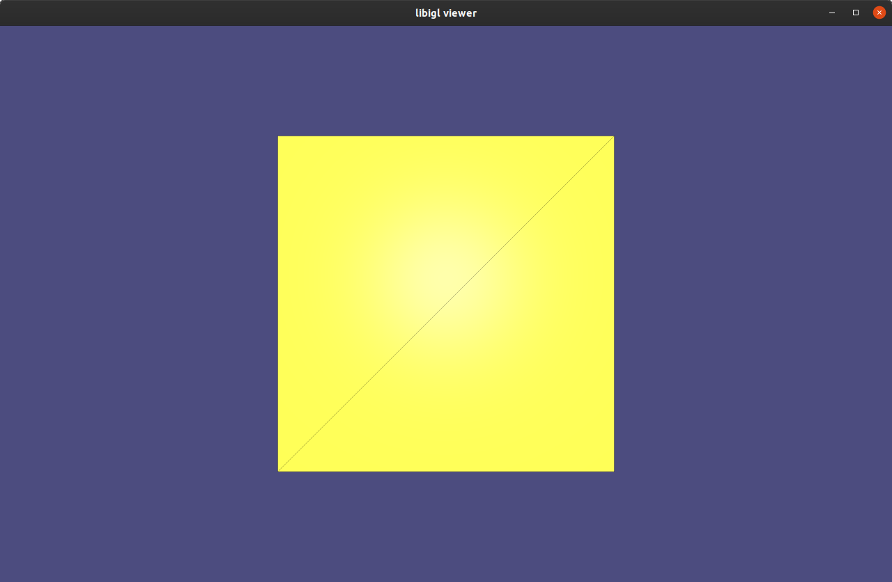

# libigl example project

A blank project example showing how to use libigl and cmake can be found
[here](https://github.com/libigl/libigl-example-project). Feel free and
encouraged to copy or fork this project as a way of starting a new personal
project using libigl.


## See the tutorial first

Then build, run and understand the [libigl tutorial](./tutorial.md).


## Dependencies

The only dependencies are the STL, [libigl](https://libigl.github.io/), Eigen3 (included in libigl) and
the dependencies of the `igl::opengl::glfw::Viewer`.

libigl can be installed by cloning the git repository on your computer:
```bash
git clone https://github.com/libigl/libigl.git
```
In the [next section](./example-project.md#compilation) we discuss how to find an existing copy of libigl when compiling the example project.

For ease of use, it can be a good idea to place your example project right next to the libigl folder.
For example, if libigl is installed in `~/foo/libigl`, then you can create a copy of the example project right next to it:
```bash
git clone https://github.com/libigl/libigl-example-project.git ~/foo/libigl-example-project
```


## Compilation

Compile this project using the standard CMake routine:

```
mkdir build
cd build
cmake ../
make
```

Just make sure that CMake is able to find libigl.
To do so CMake checks a few directories and environment variables, see [FindLIBIGL.cmake](https://github.com/libigl/libigl-example-project/blob/master/cmake/FindLIBIGL.cmake).
If your libigl version is located elsewhere, you can set the environment variable `LIBIGL_DIR` to the root directory of libigl, or pass this variable when invoking CMake from the command line:
```bash
cmake -DLIBIGL_DIR=<path-to-libigl> ..
```

This should find and build the dependencies and create a `example_bin` binary.


## Run

From within the `build` directory just issue:

```bash
./example_bin
```

A glfw app should launch displaying a 3D cube.


